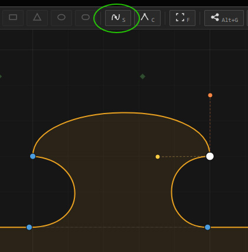
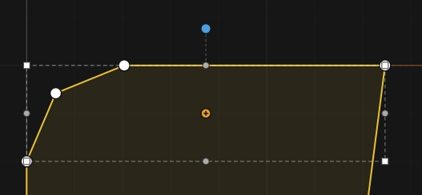
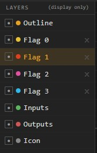
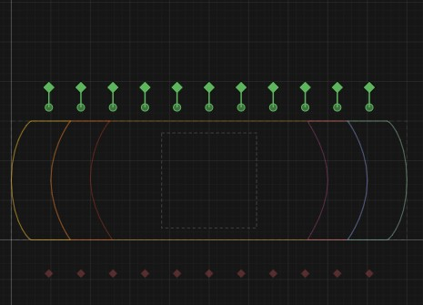
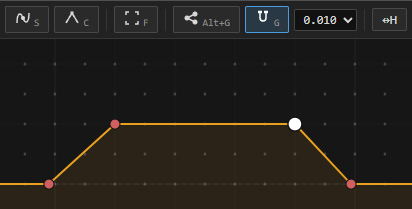
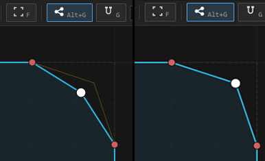
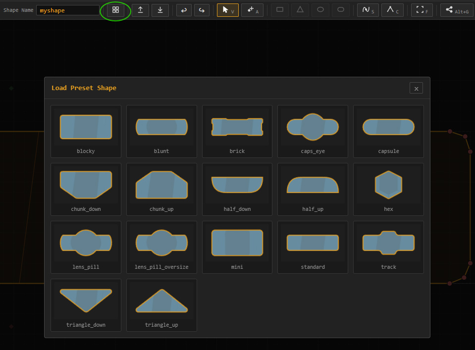
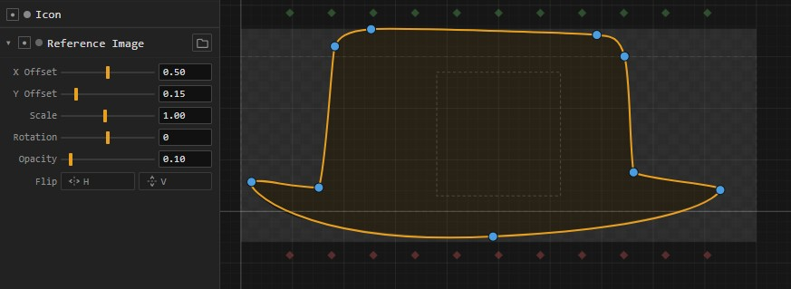

# Houdini NodeShape Designer

A browser-based tool for the niche task of creating custom node shapes for SideFX Houdini. Draw shapes with spline curves, define port positions and flag regions, and export shapes as JSON files.

<p align="center">
  <a href="https://tcrowson.github.io/houdini_nodeshape_designer/">Houdini Nodeshape Designer</a>
</p>
<p align="center">
  <a href="https://github.com/tcrowson/houdini_nodeshape_designer/releases/latest">⬇ Download offline bundle (.zip)</a>
</p>
<hr>
<p align="center">
  <i>A superfluous tool no one ever asked for...</i>
</p>


---

## Features

- **Spline curve editing** with smooth (Catmull-Rom) and corner point types
- **Shape primitives** — rectangle, triangle, ellipse, and capsule drawing tools
- **Layer system** — separate layers for outline, input/output ports, icon region, and custom flag regions
- **Transform gizmo** — scale and rotate multi-point selections with bounding box handles
- **Mirror & align** — flip or flatten selections horizontally or vertically
- **Grid snapping** with configurable increment
- **Background snap** — snap points to vertices on any visible layer
- **Reference Image** — load an image to use as reference
- **Preset library** — 17 built-in shapes to start from
- **Import/export** — load existing `.json` shapes and download new ones
- **Live preview** — real-time render of how the shape will look in Houdini
- **JSON output** — formatted export with adjustable bake resolution
- **Undo/redo** — up to 60 steps

---

## Using the Designer

### Canvas & Navigation

The canvas uses a normalized coordinate system matching Houdini's node shape spec: `(0, 0)` is the bottom-left corner of the node and `(1, 0.3)` is the top-right. The dashed bounding box on the canvas marks this boundary.

| Action | How |
|---|---|
| Pan | Middle-mouse drag |
| Zoom | Mouse wheel |
| Fit view | **F** key |

### Tools

| Key | Tool | Description |
|---|---|---|
| **V** | Select / Move | Click to select points; drag to move; Shift+click to multi-select |
| **A** | Add Point | Click on a curve segment to insert a new point |
| **D** | Delete | Click a point to remove it |
| **R** | Rectangle | Click and drag; hold Shift for a square |
| **T** | Triangle | Click and drag to place a triangle |
| **E** | Ellipse | Click and drag; hold Shift for a circle |
| — | Capsule | Click and drag to draw a rounded rectangle |
| **S** | Smooth | Convert selected points to smooth (curved) |
| **C** | Corner | Convert selected points to sharp corners |

---
### Editing Curves



Select a single smooth point to reveal its **tangent handles**:
- **Orange handle** — controls the outgoing curve direction
- **Red handle** — controls the incoming curve direction
- Drag a handle to reshape the curve
- **Ctrl+drag** a handle to break symmetry (adjust one side independently)
- **Alt+drag** a handle to restore symmetry

<br clear="right">

### Transform Gizmo



Select two or more points to activate the transform gizmo:
- Drag **corner handles** to scale; hold **Shift** for uniform scale; hold **Ctrl+Shift** to scale around the centroid
- Drag the **rotation handle** (above the top-center) to rotate; hold **Shift** to snap to 15° increments

<br clear="right">

### Layers



The left panel lists all layers in the shape:

- **outline** — the main visible boundary of the node
- **inputs** — input port positions and connection angles
- **outputs** — output port positions and connection angles
- **icon** — two corner points defining the icon bounding box
- **flag regions** — custom areas for bypass, display, lock, and other UI indicators 
- Click a layer to make it active for editing. Use the **eye icon** to toggle visibility. 
- Add new flag regions with the **+ Add Flag Region** button at the bottom of the panel.

<br clear="right">

### Ports (Inputs & Outputs)



Select the **inputs** or **outputs** layer and add points to place ports. Each port point has an **angle handle** — drag it to set the connection direction (the angle at which wires attach). The default is 90° for inputs (wires enter from below) and 270° for outputs (wires leave upward).

<br clear="right">

### Grid Snapping



Press **G** to toggle grid snapping on/off. Use the **snap increment dropdown** in the toolbar to change the grid resolution (0.005 – 0.100). Grid dots appear on the canvas when snapping is active and you are zoomed in enough to see them.

<br clear="right">

### Background Snap



Press **Alt+G** (or click the background snap button in the toolbar) to toggle background snap on/off. When active, dragging a point will snap it to the nearest vertex on any visible layer. Useful for aligning flag region corners precisely to outline vertices.

<br clear="right">

### Presets



Click the **grid icon** in the toolbar to open the preset library. Click any thumbnail to load that shape as a starting point. The preset loads immediately and replaces the current state (use undo to go back).

<br clear="right">

### Reference Image



Load a reference image to trace over or align your shape against. Click the **folder icon** next to the Reference Image layer to load any image file. Toggle visibility with the **eye icon**.

Expand the layer to reveal controls:

- **X / Y Offset** — reposition the image on the canvas
- **Scale** — resize the image (0.1–2×)
- **Rotation** — rotate the image (–180° to 180°)
- **Opacity** — adjust transparency (default 0.10)
- **Flip H / V** — mirror the image horizontally or vertically 
- Reset controls by Ctrl-MMB clicking the labels.
- This reference image is purely a visual guide and has no effect on the exported shape.

<br clear="right">

---
## Exporting Your Shape

1. **Name your shape** using the text field in the toolbar. This becomes the filename and the identifier Houdini uses.
2. Adjust **Bake Resolution** in the right panel (4–64). Higher values produce smoother curves at the cost of a larger file. A value of 6–10 is usually sufficient.
3. Click **Download** (↓ button) to save the `.json` file, or click **Copy** to copy the JSON to your clipboard.

---

## Installing Node Shapes in Houdini

### Step 1 — Locate the NodeShapes directory

Place your `.json` file in Houdini's node shapes directory. The user preferences path is:

| Platform | Path |
|---|---|
| **Linux / macOS** | `~/houdiniX.Y/config/NodeShapes/` |
| **Windows** | `C:\Users\<username>\Documents\houdiniX.Y\config\NodeShapes\` |

Replace `X.Y` with your Houdini version (e.g., `houdini20.5`). Create the `NodeShapes` folder if it doesn't exist.

> You can also place the file in any directory on your `HOUDINI_PATH` under `config/NodeShapes/`, which is useful for sharing shapes across a studio via a network location.

### Step 2 — Restart Houdini

Houdini loads node shape files at startup. Restart Houdini (or reload the node shape registry) for the new shape to become available.

---

## JSON Format Reference

The exported `.json` follows Houdini's node shape specification. All coordinates are normalized: `X` runs 0 (left) to 1 (right); `Y` runs 0 (bottom) to ~0.3 (top).

```json
{
  "name": "myshape",
  "outline": [
    [0.0, 0.0],
    [1.0, 0.0],
    [1.0, 0.3],
    [0.0, 0.3]
  ],
  "inputs": [
    [0.5, 0.0, 90]
  ],
  "outputs": [
    [0.5, 0.3, 270]
  ],
  "icon": [
    [0.05, 0.05],
    [0.95, 0.25]
  ],
  "flags": {
    "0": { "outline": [[...], ...] },
    "1": { "outline": [[...], ...] }
  }
}
```

| Field | Type | Description |
|---|---|---|
| `name` | string | Shape identifier used by Houdini |
| `outline` | `[[x, y], ...]` | Baked polygon vertices for the node boundary |
| `inputs` | `[[x, y, angle], ...]` | Input port positions and wire attachment angles (degrees) |
| `outputs` | `[[x, y, angle], ...]` | Output port positions and wire attachment angles (degrees) |
| `icon` | `[[x1, y1], [x2, y2]]` | Diagonal corners of the icon display region |
| `flags` | object | Named flag regions (bypass, display, lock, etc.) as polygon outlines |

**Wire angles:** 0° = right, 90° = up (wires come from below), 180° = left, 270° = down (wires leave upward). Inputs typically use 90° and outputs typically use 270°.

**Baked curves:** Smooth spline curves are subdivided into straight-line segments during export. The **Bake Resolution** setting controls how many segments are generated per curve interval — higher values produce rounder curves.

---

## Keyboard Shortcuts Reference

| Key | Action |
|---|---|
| **V** | Select / Move tool |
| **A** | Add Point tool |
| **D** | Delete tool |
| **R** | Rectangle tool |
| **T** | Triangle tool |
| **E** | Ellipse tool |
| **S** | Smooth selected points |
| **C** | Corner selected points |
| **G** | Toggle grid snap |
| **Alt+G** | Toggle background snap |
| **F** | Fit view to canvas |
| **Delete / Backspace** | Delete selected points |
| **Ctrl+Z** | Undo |
| **Ctrl+Y** | Redo |
| **Escape** | Deselect / close modal |
